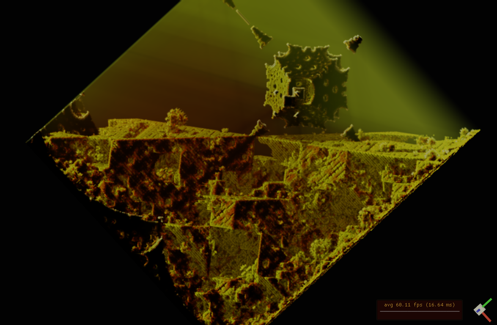
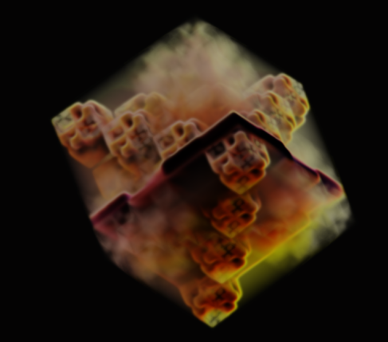
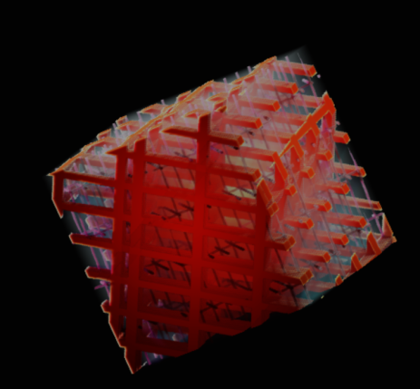
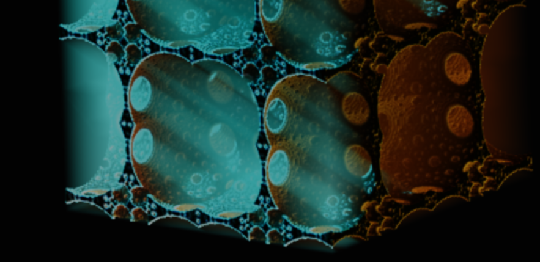
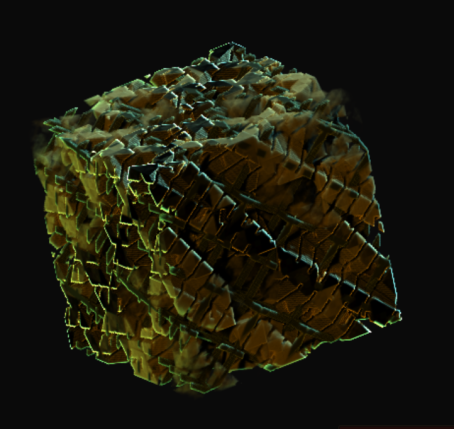
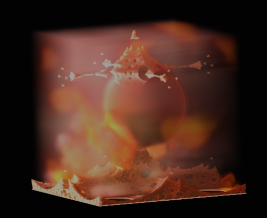
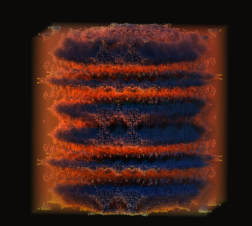
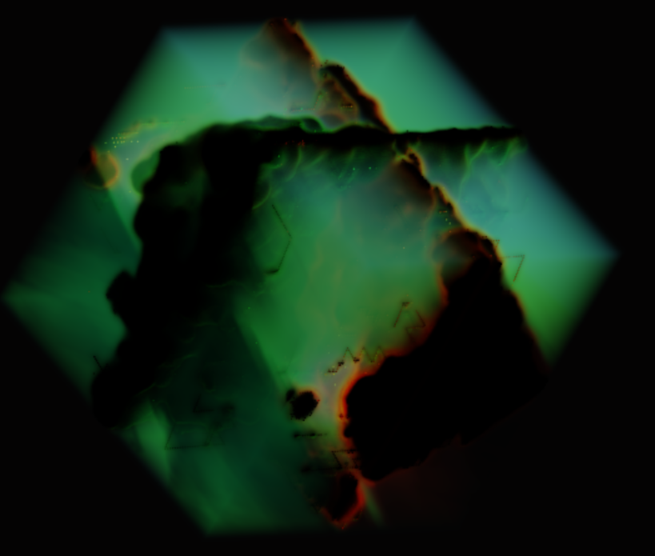
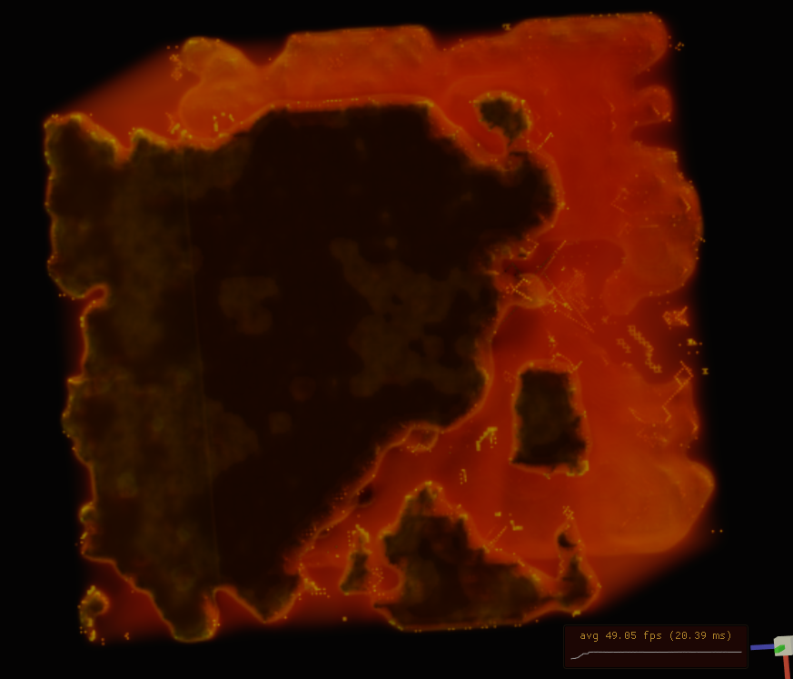

# Voraldo-v1.2
The continuation of the Voraldo project - should only have SDL2 and OpenGL as external dependencies now. Build.sh can be used from the root directory to build the executable on linux (just automates the use of cmake).

Make sure to recurse submodules for FastNoise2's Noise Tool's dependencies, as well as FastNoise2 itself. 
```
git submodule update --init --recursive
```


More recent:


<p float="left">

</p>

<p float="left">

</p>

<p float="left">

</p>
